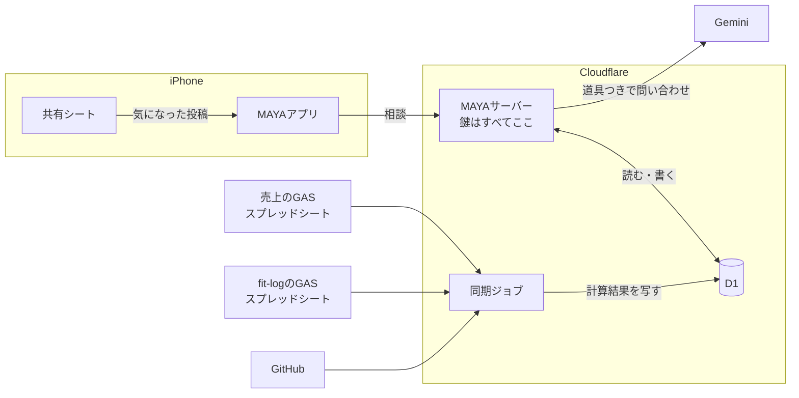

# MAYAが社長の活動を知る仕組み

MAYAに、仕事の数字だけでなく、食事や運動、コード、気になった話題まで知って
いてもらうための全体設計です。

**セッション方式の実装より先に固める**ために書きました。以後の実装はこの文書に
従います。変えるときは、先にこの文書を直します。

## 基本方針

**全部をプロンプトに詰めません。MAYAが必要なときに取りに行きます。**

いまは会社情報と判断を、送信のたびに丸ごと渡しています。そこに売上、食事、
筋トレ、GitHub、話題まで足すと、晩御飯の相談にも売上表とコミット履歴を毎回
送ることになります。費用がかさみ、応答が遅くなり、関係のない情報が増えるほど
答えがぼやけます。

代わりに、モデルが「売上を見たい」と判断したときに呼べる道具を渡します。
晩御飯の相談なら食事の記録だけ、値下げの相談なら売上だけを読みに行きます。

## 全体像



**アプリが話す相手はMAYAサーバーだけです。** アプリは鍵を1つも持ちません。

## 4つの層

### 1. アプリ

画面、キャラクター、いま開いている会話。

**鍵を持ちません。** いまは Gemini のキーを端末のキーチェーンに置いていますが、
`docs/LLM_INTEGRATION.md` に「配布するなら変える」と書いた箇所です。この設計で
変えます。

### 2. MAYAサーバー

Cloudflare Worker を1つ。アプリからの相談を受け、プロンプトを組み、道具つきで
Gemini に問い合わせ、返答を検証して返します。

**すべての鍵をここに置きます。** Gemini のキー、GitHub のトークン、D1 への接続。

**Gemini のキーは有料のものだけにします。** サーバーには実データが集まるので、
無料枠に送る経路そのものを持ちません。いまアプリにある「実在の会社なら無料枠を
塞ぐ」判定が要らなくなります。

### 3. D1

MAYAの記憶と、各データの写しを置く1つのデータベースです。

| 区分 | 中身 | 書くのは |
| --- | --- | --- |
| MAYAの記憶 | 判断、次の一手、話題、会話 | MAYAサーバー |
| 売上 | 月ごとの計算結果 | 同期ジョブ |
| 体 | 食事、筋トレ、屋外運動、体重、日々の記録 | 同期ジョブ |
| コード | リポジトリの動き | 同期ジョブ |

売上は既に売上ラボの D1 にあります。別のデータベースのまま読むか、MAYA の D1 に
寄せるかは未決定です（下の未決事項）。

### 4. 同期ジョブ

Cron Trigger で定期実行する Worker。スプレッドシートの GAS から計算結果を
取り、D1 に書きます。

売上ラボで分かったことをすべての同期に当てはめます（`docs/SALES_DATA.md`）。

- **書き込みは `env.DB.batch([...])` で1回にまとめます。** 同期の途中で読まれても、
  データが半分消えた状態を見せません
- **取り込んだ時刻 `imported_at` を必ず保存し、MAYAにも渡します。** 同期が
  止まっていても、古い数字を今の数字として言わせません
- **元データのハッシュを保存し、変わっていなければ書きません**
- **GAS の公開URLは推測されうるので、共有秘密で守ります**

## 常に渡すものと、取りに行くもの

| 常に渡す（小さい） | 取りに行く（大きい） |
| --- | --- |
| 人格と相談手順 | 売上の月次サマリー |
| 会社情報 | 食事・筋トレ・体重の記録 |
| 実行中の判断（最大12件） | リポジトリの動き |
| 今日の日付と時刻 | 貯めた話題の検索 |
| 今の会話 | 完了した過去の判断 |

**判断は常に渡し続けます。** 数が少なく、どの相談にも矛盾の確認が要るからです。

### 道具の案

```
getSalesSummary(period)            月の売上・粗利・商品別
getFitness(from, to, kinds)        食事 / 筋トレ / 屋外運動 / 体重 / 日々の記録
getRepoActivity(repo, days)        コミット、Issue、PR の要約
searchTopics(query)                共有シートから貯めた話題
searchDecisions(query)             完了した判断を含む全件
```

### 確かめるべき技術的な制約

**Gemini で「道具を呼ばせる」と「決まった JSON で返させる」を1回の問い合わせで
同時に使えるか、未確認です。** MAYAの返答は表情や判断を JSON で受け取る契約
なので、ここが両立しないと、道具を呼ぶ往復と、最終の返答を JSON で組む往復の
2段に分ける必要があります。**MAYAサーバーを作る最初の段階で確かめます。**

## データ源ごとの扱い

### 売上

売上ラボの D1 をそのまま使います。詳細は `docs/SALES_DATA.md`。

### fit-log

スプレッドシートのうち、次の5つを D1 に写します。

| シート | 中身 |
| --- | --- |
| `meals` | 日付、時刻、食事の種類、料理名、カロリー、たんぱく質・脂質・炭水化物 |
| `log` | 筋トレの記録 |
| `outdoor_logs` | 屋外運動。距離、時間、心拍、消費カロリー、獲得標高 |
| `body_metrics` | 体重、体脂肪率 |
| `day_logs` | 休日かどうか、気分、メモ |

**写さないもの**

- **`body_photos`。体の写真は fit-log から外に出しません。** MAYAが知る必要が
  あるのは体重の推移で、写真ではありません
- 図鑑や二つ名などの遊びの要素。MAYAの相談には関係しません
- fit-log の AI が付けたコメント。MAYA が別の AI の感想を自分の意見のように
  言い直すのを避けます

iPhone のヘルスケアは当面つなぎません。体重は fit-log にあり、歩数だけの
ために端末の権限を求める価値はまだ薄いと判断しました。

### GitHub

読み取り専用のきめ細かいトークンを MAYAサーバーに置きます。コードの中身は
読みません。**コミット、Issue、PR の件名と日時だけ**を扱います。

「今週は MAYA の開発に何日使ったか」「fit-log を最後に触ったのはいつか」に
答えられれば足ります。

### X の話題

**MAYAが X を見に行く方式は取りません。** X の API は有料で制約が多く、自動で
読み取るのは規約に触れます。

代わりに、**気になった投稿を iPhone の共有シートから MAYA に送ります。**
URL、本文、社長のひとことを保存します。社長が選んだものだけが残るので、
何でも読ませるより判断の材料として質が上がります。

## 守るもの

| データ | 重さ | 扱い |
| --- | --- | --- |
| 体の写真 | 最も重い | MAYA に渡さない |
| 食事・体重 | 私的な健康情報 | サーバー内だけ。有料キーだけに送る |
| 売上 | 事業の機密 | 同上 |
| GitHub | 件名と日時のみ | 同上 |
| 話題 | 公開情報 | 同上 |

- **アプリと MAYAサーバーの間に認証を入れます。** 方式は未決定
- **アプリに鍵を置きません**
- **無料枠の Gemini キーを持ちません**

## 製品の位置づけの変更

**ここだけは社長の承認が要ります。**

PRD §1 はいまこう書いています。

> It is not positioned as an AI girlfriend, generic chatbot, virtual secretary,
> or conventional consulting bot.

「社長の全部の活動を知っている秘書」は、このうち virtual secretary に触れます。
README も v0.1 から外部連携をすべて外しています。

提案する書き換えです。

> MAYA is an executive partner who knows the president's whole working life —
> the business numbers, the decisions, the code, the body that has to keep up
> with all of it. It is not positioned as an AI girlfriend, a generic chatbot,
> or a conventional consulting bot.

**AI彼女ではない、という線は残します。** 生活を知っていることと、恋人のように
振る舞うことは別です。PRD §5 の 80 / 15 / 5 の配分もそのままです。

## 段階

| 段階 | 中身 | サーバー |
| --- | --- | --- |
| **v0.1** | セッション方式、話題の受け箱、判断記録 | 要らない |
| **v0.2** | MAYAサーバー、鍵の移動、記憶を D1 へ、アプリの認証 | 作る |
| **v0.3** | 道具を渡す。売上、fit-log、GitHub の順につなぐ | 使う |
| 後で | ヘルスケアの歩数、声（相槌から） | |

**v0.1 はアプリだけで完結させます。** サーバーを作る前にセッション方式と話題の
受け箱を入れておけば、v0.2 で記憶を D1 へ移すときに、何を移すかが決まっています。

## 未決事項

1. **PRD §1 の書き換え。** 上の提案でよいか
2. **アプリと MAYAサーバーの認証方式。** Cloudflare Access のサービストークンか、
   端末ごとのトークンか
3. **会話を D1 に移すか。** 移すと複数の端末で続きができる。残すと通信が無くても
   過去の会話が読める
4. **売上を売上ラボの D1 から直接読むか、MAYA の D1 に寄せるか**
5. **fit-log の同期の頻度**
6. **GitHub のどのリポジトリを対象にするか**
7. **話題をいつまで残すか**
