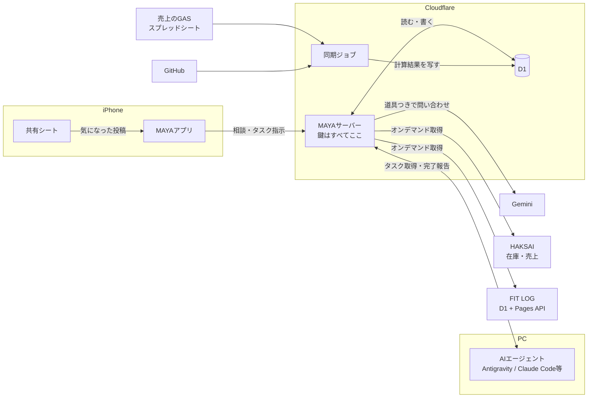
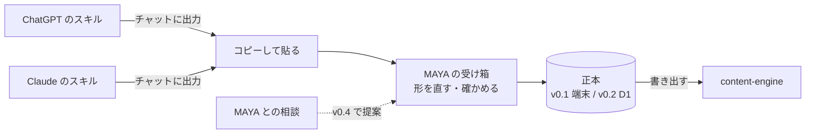

# MAYAがGakkyの活動を知る仕組み

MAYAに、仕事の数字だけでなく、食事や運動、コード、気になった話題まで知って
いてもらうための全体設計です。

**セッション方式の実装より先に固める**ために書きました。以後の実装はこの文書に
従います。変えるときは、先にこの文書を直します。

## 基本方針

**全部をプロンプトに詰めません。MAYAが必要なときに取りに行きます。**

いまは会社情報と判断を、送信のたびに丸ごと渡しています。そこに売上、食事、
筋トレ、GitHub、話題まで足すと、晩御飯の相談にも売上表とコミット履歴を毎回
送ることになります。費用がかさみ、応答が遅くなり、関係のない情報が増えるほど
答えがぼやけます。

代わりに、モデルが「売上を見たい」と判断したときに呼べる道具を渡します。
晩御飯の相談なら食事の記録だけ、値下げの相談なら売上だけを読みに行きます。

## 全体像



**アプリが話す相手はMAYAサーバーだけです。** アプリは鍵を1つも持ちません。

## 4つの層

### 1. アプリ

画面、キャラクター、いま開いている会話。

**鍵を持ちません。** いまは Gemini のキーを端末のキーチェーンに置いていますが、
`docs/LLM_INTEGRATION.md` に「配布するなら変える」と書いた箇所です。この設計で
変えます。

### 2. MAYAサーバー

Cloudflare Worker を1つ。アプリからの相談を受け、プロンプトを組み、道具つきで
Gemini に問い合わせ、返答を検証して返します。

**すべての鍵をここに置きます。** Gemini のキー、GitHub のトークン、D1 への接続。

**無料と有料の2つのキーを、いまと同じ規則で使います。** 無料を優先し、有料への
切り替えは既定で切っておき、実在の会社として登録した情報が乗るときは無料枠を
塞ぎます（`docs/LLM_INTEGRATION.md`）。鍵の置き場所がアプリからサーバーに移る
だけで、規則は変えません。

体重や食事の記録は、無料枠で学習に使われても構わないとGakkyが判断しました
（2026-09-13）。**売上は、実在の会社の判定をそのまま当てはめます。** 道具で取りに
行く売上の数字も、会社情報と同じく、実在の会社なら無料枠に送りません。

### 3. D1

MAYAの記憶と、各データの写しを置く1つのデータベースです。

| 区分 | 中身 | 書くのは |
| --- | --- | --- |
| MAYAの記憶 | 判断、次の一手、話題 | MAYAサーバー |
| 活動と個人の文脈 | CONTENT_LOG と Journal の写し | PCからの同期 |
| 売上 | 月ごとの計算結果 | 同期ジョブ |
| 体 | 食事、筋トレ、屋外運動、体重、日々の記録 | 直接参照（Fit-Log D1化により同期不要で直通） |
| コード | リポジトリの動き | 同期ジョブ |
| AIエージェントへの指示 | 会話から切り出した改善指示・タスク (`agent_inbox`) | MAYAサーバー（アプリから指示） |

**会話は D1 に移しません。** これまでの会話はテスト用で、端末の中に残れば足ります
（2026-09-13 決定）。

ただし、**AIエージェントに渡したい指示・改善タスクだけを切り出してD1に置く箱は作ります**
（2026-09-22 構想追加）。会話の全件を保存するのではなく、開発や調査に回したい要件・文脈
だけを抜粋して入れます。

**売上は MAYA の D1 に寄せます**（2026-09-13 決定）。売上ラボとは別に、MAYA の
同期ジョブが計算結果を取り込みます。

### 4. 同期ジョブ

Cron Trigger で定期実行する Worker。スプレッドシートの GAS から計算結果を
取り、D1 に書きます。

売上ラボで分かったことをすべての同期に当てはめます（`docs/SALES_DATA.md`）。

- **書き込みは `env.DB.batch([...])` で1回にまとめます。** 同期の途中で読まれても、
  データが半分消えた状態を見せません
- **取り込んだ時刻 `imported_at` を必ず保存し、MAYAにも渡します。** 同期が
  止まっていても、古い数字を今の数字として言わせません
- **元データのハッシュを保存し、変わっていなければ書きません**
- **GAS の公開URLは推測されうるので、共有秘密で守ります**

## 常に渡すものと、取りに行くもの

| 常に渡す（小さい） | 取りに行く（大きい） |
| --- | --- |
| 人格と相談手順 | 売上の月次サマリー |
| 会社情報 | 食事・筋トレ・体重の記録 |
| 実行中の判断（最大12件） | リポジトリの動き |
| 今日の日付と時刻 | 貯めた話題の検索 |
| 今の会話 | 完了した過去の判断 |
| | 活動の記録（CONTENT_LOG） |
| | 本人の文脈（Journal） |

**判断は常に渡し続けます。** 数が少なく、どの相談にも矛盾の確認が要るからです。

### 道具の案

```
getSalesSummary(period)            月の売上・粗利・商品別
getFitness(from, to, kinds)        食事 / 筋トレ / 屋外運動 / 体重 / 日々の記録
getRepoActivity(repo, days)        コミット、Issue、PR の要約
searchTopics(query)                共有シートから貯めた話題
searchDecisions(query)             完了した判断を含む全件
getActivity(project, days)         CONTENT_LOG の出来事
searchJournal(query)               Journal の記録
proposeJournalEntry(kind, text)    記録の提案。保存は本人の確認後
```

### 確かめるべき技術的な制約

**公式の説明では、Gemini 3 系なら「道具を呼ばせる」と「決まった JSON で返させる」を
同時に使えます**（2026-09-13 確認）。MAYA の既定モデル `gemini-3.6-flash` はこの系統です。
ただし、この組み合わせはプレビュー扱いです。

**2026-09-13 に無料キーで実際に呼び、両立することを確かめました。** 2段に分ける
必要はありません。結果は `docs/LLM_INTEGRATION.md` の「道具と JSON の両立」。

**ただし、確かめたのは `gemini-3.6-flash` です。** 2026-09-14 に、3.6 の無料枠が
1日20回しかないことが分かり、サーバーの既定を `gemini-3.5-flash-lite` に変えました。
**Flash-Lite で道具と JSON が両立するかは未検証です。** `search_memory` を本番に
出す前に、このモデルで確かめてください。両立しないなら、道具を使う経路だけ
3.6 に切り替えるか、2段に分ける必要が出ます。

**道具の結果には、対象の期間を必ず入れます。** 確認では今日の日付を渡していなかった
ため、モデルは「先月」を 2024-05 と解釈して道具を呼びました。そして 2026-08 の
数字が返ると、疑わずに「先月（2026年8月）」と答えました。サーバーは頼まれた期間と
返す期間を突き合わせ、違えばその旨を結果に書きます。

## データ源ごとの扱い

### 売上

MAYA の D1 に取り込みます。スキーマは売上ラボの形を踏襲します。取り込み時の
約束は `docs/SALES_DATA.md` のとおりです。

### fit-log

スプレッドシートのうち、次の5つを D1 に写します。

| シート | 中身 |
| --- | --- |
| `meals` | 日付、時刻、食事の種類、料理名、カロリー、たんぱく質・脂質・炭水化物 |
| `log` | 筋トレの記録 |
| `outdoor_logs` | 屋外運動。距離、時間、心拍、消費カロリー、獲得標高 |
| `body_metrics` | 体重、体脂肪率 |
| `day_logs` | 休日かどうか、気分、メモ |

**写さないもの**

- **`body_photos`。体の写真は fit-log から外に出しません。** MAYAが知る必要が
  あるのは体重の推移で、写真ではありません
- 図鑑や二つ名などの遊びの要素。MAYAの相談には関係しません
- fit-log の AI が付けたコメント。MAYA が別の AI の感想を自分の意見のように
  言い直すのを避けます

#### 同期のしかた（2026-09-13 提案、Gakky承認）

記録は、Gakkyが入力した瞬間にすべて fit-log の GAS を通ります。ウォーキングも、
画面の取り込みの時点で入ります。その瞬間を使います。

1. **記録した直後に MAYA へ知らせる。** 保存が成功したら、その記録を MAYAサーバーへ
   送ります。数秒後には「さっき食べたもの」を把握しています
2. **毎晩4時に全体を突き合わせる。** 送り損ねた記録、あとで直した記録、消した記録を
   拾います。夜の筋トレのあと、fit-log 自身の3時の処理が終わってから動かします

15分おきの取得は採りません。常に最大15分遅れ、ほとんどが空振りで、そのたびに
GAS の実行時間を使います。

食事と屋外運動は ID で更新します。体重は日付で揃えます。筋トレは fit-log が
1日分を丸ごと書き直す作りなので、同期も1日単位で入れ替えます。

#### 毎日使っているアプリなので、安全に入れる

MAYAサーバーができて、通知の宛先が決まってから手を入れます。

- **通知は保存が成功したあとにだけ送り、失敗しても保存には影響させない。** 例外は
  握りつぶし、アプリへ返す応答は変えない
- **スクリプトのプロパティで入切する。** 宛先が空なら何もしない。止めたいときは
  コードを戻さずに止められる
- **MAYAサーバーはすぐに受け取りを返し、処理はそのあとで行う。** fit-log の保存を
  待たせない
- **新しい権限は要らない。** 外部への通信の権限は既に付いているので、Google の
  再承認で使えなくなる時間が生まれない
- **本番の前にテスト用のデプロイで確かめ、本番は同じURLのまま版だけ上げる。**
  元の版の番号を控えておき、戻すときはそれを選び直す
- **毎晩の突き合わせがあるので、通知を落としても記録は欠けない**

#### 気づいたこと（今回の変更の範囲外）

- fit-log の Web アプリは、ログインなしで誰でも書き込める設定になっている。
  1日分を消して書き直す操作も含むので、URL が漏れると記録を消されうる
- GAS のコードに Google ドライブのフォルダの ID が直接書かれている。リポジトリが
  公開で、フォルダがリンク共有なら、体の写真のフォルダに外から届く

iPhone のヘルスケアは当面つなぎません。体重は fit-log にあり、歩数だけの
ために端末の権限を求める価値はまだ薄いと判断しました。

### GitHub

読み取り専用のきめ細かいトークンを MAYAサーバーに置きます。コードの中身は
読みません。**コミット、Issue、PR の件名と日時だけ**を扱います。

「今週は MAYA の開発に何日使ったか」「fit-log を最後に触ったのはいつか」に
答えられれば足ります。

### X の話題

**MAYAが X を見に行く方式は取りません。** X の API は有料で制約が多く、自動で
読み取るのは規約に触れます。

代わりに、**気になった投稿を iPhone の共有シートから MAYA に送ります。**
URL、本文、Gakkyのひとことを保存します。Gakkyが選んだものだけが残るので、
何でも読ませるより判断の材料として質が上がります。

## 記憶の出どころ

**MAYAは記憶の分類を自分で作りません。** 既にある記録の仕組み（content-engine）を
読み、そこへ書き込む入口になります。MAYA 自身のデータベースに残すのは、判断と
会話だけです。

### 既にあるもの

2026-09-13 に数えた時点で、CONTENT_LOG は52フォルダに134件ありました。

| 仕組み | 問い | 置き場所 | 根拠 |
| --- | --- | --- | --- |
| CONTENT_LOG | 何が起きたか | 各プロジェクトの直下 | README、コミット、設計書 |
| Journal | なぜやったか、どう感じたか | content-engine に集約 | 本人との会話 |
| Project Connection | プロジェクト同士の関係 | Journal の中 | 本人の確認か、資料の日付 |

**Journal は情報を4種類に分けます。** これが、作り話を事実として残さない仕組みです。

| 種別 | 意味 |
| --- | --- |
| `FACT` | 資料で裏取りできる事実 |
| `USER_RECOLLECTION` | 本人の記憶。裏取りは無いが、本人の発言として残す |
| `USER_OPINION` | 本人の評価や感想 |
| `AI_INTERPRETATION` | AIの解釈。本人が受け入れたか却下したかを一緒に残す |

CONTENT_LOG の `sensitivity` もそのまま使います。

| 値 | MAYAでの扱い |
| --- | --- |
| `home` | 読んでよい |
| `business` | 売上と同じ。実在の会社なら無料枠に送らない |
| `company` | 読まない。勤務先の情報を個人の相談に持ち出さない |
| `private` | そもそも記録されない |

### Journal は MAYA に集める

Journal は GPT や Claude のスキルがチャットに出力します。**その出力の保存先が
決まっていなかった**ことが、2026-09-09 の4件で止まった理由でした。書く手間では
なく、置き場所の問題です。

**どの経路で書いた Journal も、MAYA の受け箱に貼ります**（2026-09-13 決定）。
正本は MAYA に置きます。v0.1 では端末の SQLite、v0.2 で D1 に移します。
content-engine で使うときは、MAYA から書き出します。



受け箱でやること（2026-09-13 実装）。

1. **崩れた形を直す。** チャットの表示を通ると、箇条書きの `-` が `*` になり、
   次の項目が前の箇条書きの下に字下げされて、YAML として読めなくなる。既知の
   項目名を手がかりに、字下げを信用せず構造を取り戻す
2. **文面には手を加えない。** 形は直しても言葉は直さない。モデルで書き直すと、
   本人の記録がモデルの言葉になる
3. **読み取った内容と、足りない項目を見せる。** 足りなくても保存は止めない
4. **AI の解釈を受け入れるかを訊く。** `ai_feedback.accepted` が空のまま届くので、
   その場で受け入れる・却下・あとでを選び、理由を残せる
5. **`private` は保存しない。** content-engine の決まりで、記録にしない領域
6. **同じ日付と題の記録があれば知らせる。** 試しに1回、本番で1回と、二重に貼られやすい
7. **整えた形で書き出せる。** content-engine へ持っていくときの形
8. **知らない項目は捨てずに残す。** スキルは `journal_version` を持ち、項目が増えていく

**Claude Code から書く場合は、v0.2 以降は貼り付けも要らなくなります。** スキルから
MAYAサーバーへ直接送れます。

**スキルの出力をコードブロックで囲むと、そもそも形が崩れません。** スキルの側を
変えるかどうかはGakkyの判断です。

### 週に1回の振り返り

CONTENT_LOG、判断、Journal、fit-log から、MAYA がその週をまとめます。
秘書の仕事としてすぐに役立ち、content-engine が本来ほしかった「あとで
コンテンツにする材料」にもなります。

Journal を別の作業として書く運用は、2026-09-09 の4件で止まっていました。
覚えていないとできない作業は続かず、何かのついでに起きることは続きます。

### コードの無い活動

ダイエット、家族、動画のチャンネルなど、フォルダを持たない活動は CONTENT_LOG に
入りません。**Journal はプロジェクトをまたいで集める設計なので、そちらに入ります。**
体重や食事の数字は、健康記録アプリの写しから取ります。

### プロジェクトの一覧

**リポジトリからは作りません。** 2026-09-13 に Documents の git フォルダを数えた
ところ、32個ありましたが、プロジェクトとは対応していませんでした。

- 1つの事業が、30近いフォルダに分かれている
- 1つのアプリが、本体・スクリプト・動画の3か所にまたがる
- リポジトリの無いプロジェクトや、同じリポジトリの複製がある
- コードの無いプロジェクトがある

**一覧はGakkyが決め、MAYA はフォルダとリポジトリから候補を出します。** プロジェクト
ごとに別名を持たせるので、「あのキャラ動かすやつ」のような呼び方でも引けます。

### PC の中にしかないもの

CONTENT_LOG と Journal の多くは PC の中にだけあり、リモートが無いものもあります。
MAYAサーバーからは PC の中を読めないので、**PC から D1 へ送る同期を1本作ります。**

### 待っていること

**content-engine は 2026-09-09 から1〜2週間の観察中です。** Journal の形は、その
結果で変わりえます。MAYA からの読み書きは、観察が終わってから設計を固めます。

## AIエージェントへの指示・受け渡し箱（今後の開発構想）

MAYA（iPhoneアプリ）とGakkyが会話した内容から、PC上のAIエージェント（Antigravity、
Claude Code、Codexなど）に渡したい改善指示や開発タスクだけを切り出して共有する仕組み
です（2026-09-22 構想追加）。

### 背景と目的

- **会話の全件保存とタスク受け渡しの違い**: MAYAとの会話エクスポートは会話ログの
  保全が目的であり、そのまま開発エージェントに渡しても文脈ノイズが多く、即座の作業
  着手には向きません
- **スマホでの壁打ちからPCでの実装への直結**: iPhoneでMAYAと相談して固まった
  「MAYA自身の機能改善」「HAKSAIの機能追加」「他プロジェクトの開発タスク」などを、
  PCの前に座ったAIエージェントがすぐに取得して実装に進めるパイプラインを作ります

### 全体の流れ

```mermaid
flowchart LR
  subgraph iPhone
    App[MAYAアプリ]
  end

  subgraph Cloudflare
    Worker[MAYAサーバー]
    D1[(D1<br/>agent_inbox)]
  end

  subgraph PC
    Agent[AIエージェント<br/>Antigravity / Claude Code等]
    Skill[エージェント用スキル<br/>SKILL.md / ツール]
  end

  App -->|1. 指示・改善案を保存| Worker
  Worker -->|2. 書く (status=OPEN)| D1
  Agent -->|3. 未着手タスク確認| Skill
  Skill -->|4. Cloudflare Access経由で照会| Worker
  Worker -->|5. 指示・背景を返す| Skill
  Skill -->|6. 完了報告 (status=COMPLETED)| Worker
```

1. **iPhone（MAYAアプリ）**:
   - 会話の中で改善やタスクの話になった際、MAYAが「この内容をAIエージェント向けの受け箱に入れますか？」と要約を提示するか、Gakkyが該当メッセージからタスク化を指定します
   - **自動保存はせず、本人が確認してから送る原則を守ります**（勝手にタスク化してノイズを増やさない）
2. **MAYAサーバー & D1（Cloudflare）**:
   - 専用テーブル `agent_inbox` に保存します（ステータスは `OPEN`）
3. **PC上のAIエージェント**:
   - 各エージェント（Antigravity、Claude Code等）に専用スキル（`SKILL.md` やスクリプト）を配備します
   - エージェントが「MAYAからの指示はあるか？」と確認すると、未着手の指示を取得します
   - 実装開始時に `IN_PROGRESS`、実装とテスト完了時にコミットハッシュや作業概要を添えて `COMPLETED` に更新します

### D1の保存形式（スキーマ案: `agent_inbox`）

| カラム | 型 | 説明 |
| --- | --- | --- |
| `id` | TEXT PRIMARY KEY | タスクの一意識別子（ULID等） |
| `created_at` | TEXT | 登録日時（ISO 8601） |
| `target_project` | TEXT | 対象プロジェクト名（例: `maya-executive-partner`, `haksai`） |
| `title` | TEXT | 指示の要約見出し |
| `instructions` | TEXT | エージェントへの指示本文（Markdown形式） |
| `conversation_excerpt` | TEXT | 経緯が分かる会話の抜粋・背景文脈 |
| `status` | TEXT | `OPEN` / `IN_PROGRESS` / `COMPLETED` / `CANCELLED` |
| `completed_at` | TEXT | 完了日時 |
| `agent_notes` | TEXT | エージェントからの作業報告やコミットハッシュ |

### 守り方と接続

- **Cloudflare Access で守る**: スマホからの通信と同様、Cloudflare Access で外部を遮断します
- **サービストークンでどのエージェントからも読めるようにする**: PC上の環境変数等に Access のサービストークンを設定することで、Antigravity、Claude Code、Codexなど、PC上のどのAIエージェントからでも安全に MAYAサーバーのエンドポイントを叩けるようにします

## 採らない設計

別のAIが提案した記憶の設計をレビューした結論です。方向は同じですが、次の点は
採りません。

- **会話から記憶を自動で抜き出して保存しない。** このプロジェクトでは、MAYA が
  見ていない顔を見たと言い、言われていない発言を「さっき」と持ち出した。自動で
  抜き出すと、作り話が事実として永久に残る。提案して、本人が確かめてから保存する
- **モデルが付けた確信度や重要度で並べない。** モデル自身の数字は、実際の
  確からしさと対応していない。新しさ、状態、名前と別名の一致で並べる
- **相談の返答と、記憶の抽出を同じ問い合わせにしない。** 小さな欄を増やすほど
  返答が崩れる（`docs/LLM_INTEGRATION.md`）
- **意味検索は最初から入れない。** 1人分なら年に数百件で、別名の表で足りる。
  足りないと分かったら、サーバー側で Vectorize を使う。スマホの SQLite に
  ベクトル検索の拡張を入れられるかは未確認
- **記憶をまとめる処理で、元の記憶を消さない。** まとめは元を残した要約として作る
- **話を切り出すのは1日1回まで、実データがあるときだけ。** 毎回だと小言になる。
  活動をモデルに推測させない
- **書き込みの操作は入れない。** メールの送信や予定の登録は、当面扱わない

## 守るもの

| データ | 重さ | 扱い |
| --- | --- | --- |
| 体の写真 | 最も重い | MAYA に渡さない |
| 食事・体重 | 本人は秘密と考えていない | 無料枠にも送ってよい |
| 売上 | 事業の機密 | 実在の会社なら無料枠に送らない |
| GitHub | 件名と日時のみ | 無料枠にも送ってよい |
| 話題 | 公開情報 | 無料枠にも送ってよい |

- **アプリと MAYAサーバーの間は、Cloudflare Access のサービストークンで守ります**
  （2026-09-13 決定）。Cloudflare の入口で確かめるので、合わない通信はサーバーの
  コードまで届きません。トークンは設定画面で1回入力し、端末の安全な保管場所に置きます。
  利用者は1人・端末は1台なので、端末ごとのトークンは作りません
- **アプリに鍵を置きません**

## 製品の位置づけの変更

**2026-09-13 にGakkyが承認し、PRD §1 を書き換えました。**

PRD §1 はいまこう書いています。

> It is not positioned as an AI girlfriend, generic chatbot, virtual secretary,
> or conventional consulting bot.

「Gakkyの全部の活動を知っている相棒」は、このうち virtual secretary に触れます。
README も v0.1 から外部連携をすべて外しています。

提案する書き換えです。

> MAYA is an executive partner who knows the president's whole working life —
> the business numbers, the decisions, the code, the body that has to keep up
> with all of it. It is not positioned as an AI girlfriend, a generic chatbot,
> or a conventional consulting bot.

**AI彼女ではない、という線は残します。** 生活を知っていることと、恋人のように
振る舞うことは別です。PRD §5 の 80 / 15 / 5 の配分もそのままです。

## 段階

| 段階 | 中身 | サーバー |
| --- | --- | --- |
| **v0.1** | セッション方式（済）、判断記録（済）、受け箱（済。Journal と話題） | 要らない |
| **v0.2** | MAYAサーバー（手元で動作）、鍵の移動、記憶を D1 へ、アプリの認証、プロジェクトの一覧 | 作る |
| **v0.3** | 道具を渡す。売上、fit-log、CONTENT_LOG、GitHub の順につなぐ | 使う |
| **v0.4** | 相談の中で MAYA が Journal を提案する / AIエージェントへのタスク受け渡し箱（D1 `agent_inbox`） | 使う |
| 後で | ヘルスケアの歩数、声（相槌から） | |

### v0.2 の進め方

| 段階 | 中身 | Cloudflare に作るもの | 状態 |
| --- | --- | --- | --- |
| 1 | 手元でサーバーを動かし、相談をアプリと同じ動きで通す | なし | 済（2026-09-13） |
| 2 | 記憶の読み書き。判断、次の一手、話題、Journal、プロジェクト | なし | 済（2026-09-13） |
| 3 | アプリをサーバーにつなぐ | なし | 済（2026-09-13、実機で確認） |
| 4 | Cloudflare に置く。D1、秘密、Access、デプロイ | **ここで作る。事前に確認する** | 済（2026-09-14 実機で接続を確認） |

**プロンプト、スキーマ、検証、Gemini の呼び出しはアプリから読み込み、写しません。**
MAYA の答え方を変えれば、スマホとサーバーの両方に同時に効きます。そのために、
料金の見積もりと無料枠の判定を、端末の保存に依存しない `src/services/llm/policy.ts`
へ切り出しました。

**相談のときに読む判断は、アプリから送らせずサーバーが D1 から読みます。** どの経路で
相談しても、同じ判断を覚えています。確かめたところ、見直し中にした判断の理由を持ち出し、
「何が変わったんですか？」と反論しました。

**Journal はサーバーでも同じ読み取りをします。** 崩れた生テキストだけを送れば、サーバーが
アプリと同じ読み取りで保存します。Claude Code のスキルから画面を通さず送る経路のためです。

**プロジェクトは名前と別名で引けます。** 大文字小文字、全角半角、空白の違いは無視し、
「あのキャラ動かすやつ」のような言い方も、別名を含んでいれば引けます。

**判断は日付しか渡していません。** 数分前に保存した判断を、MAYA は「数時間で何が変わった
んですか？」と言いました。保存した時刻まで渡すかは、見直す候補です。

**アプリは、設定でサーバーのアドレスを入れたときだけサーバーを使います。** 空なら今までどおり
Gemini を直接呼び、記憶もスマホに置きます。**つながらないときに、黙って直接呼びに戻ることは
しません。** 戻ると判断がスマホとサーバーに分かれ、MAYA はそのとき届いた側の半分しか覚えて
いない状態になります。

一覧の読み込みに失敗したときは、空の一覧ではなくエラーを見せます。障害中に「判断はまだ
ありません」と表示するのは、何も保存していないのに「保存しました」と出していた以前の不具合と
同じ種類の嘘です。

**置き場所は workers.dev です**（2026-09-13 決定）。gakky.jp の DNS は Cloudflare の外にあり、
Worker を独自ドメインに置けないためです。アドレスを使うのはアプリだけなので、見た目は問いません。

**サーバーは Access の署名を自分でも検証し、Access の設定が済むまですべて断ります。** デプロイ
直後に外から叩き、健康確認、判断、Journal、相談、偽のトークンがすべて 403 になることを
確かめました。先にデプロイし後から Access を設定しても、無防備な時間が生まれません。

**サーバーの時間帯は、Gakkyの時間帯ではありません。** Cloudflare は UTC で動き、
手元の開発用サーバーは PC の時間帯で動きます。最初は UTC と決めつけて9時間足した
ため、手元では21時47分に MAYA が「朝です、まだ7時前です」と答えました。今は実行
環境の時間帯を測ってずらします（`server/src/clock.ts`）。料金の上限は東京の日付で
区切ります。

**v0.1 はアプリだけで完結させます。** サーバーを作る前にセッション方式と話題の
受け箱を入れておけば、v0.2 で記憶を D1 へ移すときに、何を移すかが決まっています。

## 未決事項

1. ~~PRD §1 の書き換え~~ 承認済み（2026-09-13）
2. ~~アプリと MAYAサーバーの認証方式~~ Access のサービストークン（2026-09-13）
3. ~~会話を D1 に移すか~~ 移さない（2026-09-13）
4. ~~売上をどこから読むか~~ MAYA の D1 に寄せる（2026-09-13）
5. ~~fit-log の同期のしかた~~ 記録直後の通知と毎晩の突き合わせ（2026-09-13）
6. **GitHub のリポジトリをどう見つけるか。** 増えるたびに教える運用はしない。
   トークンの対象を「すべてのリポジトリ」にし、新しいものは MAYA が1回だけ訊く案
7. ~~話題をいつまで残すか~~ ずっと残す（2026-09-13）
8. ~~Journal の正本をどこに置くか~~ MAYA。どの経路の Journal も受け箱に貼る（2026-09-13）
9. **CONTENT_LOG と Journal を PC から D1 へ送る方法**
10. ~~GPT と Claude のスキルが Journal をどこへ書いているか~~ チャットに出力するだけで、保存先は無かった（2026-09-13）
11. **MAYAからAIエージェントへのタスク切り出しUI。** 会話の長押しメニュー等から手動で切り出すか、MAYA自身が「タスクとしてエージェントの受け箱に入れますか？」と提案するか

