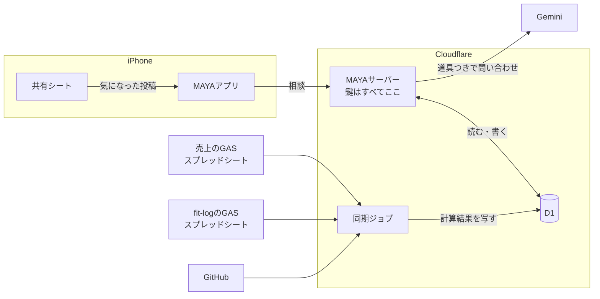
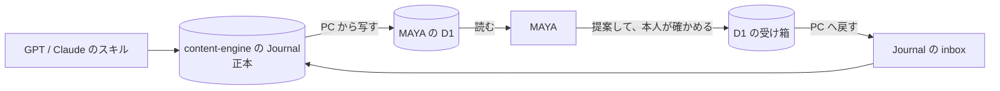

# MAYAが社長の活動を知る仕組み

MAYAに、仕事の数字だけでなく、食事や運動、コード、気になった話題まで知って
いてもらうための全体設計です。

**セッション方式の実装より先に固める**ために書きました。以後の実装はこの文書に
従います。変えるときは、先にこの文書を直します。

## 基本方針

**全部をプロンプトに詰めません。MAYAが必要なときに取りに行きます。**

いまは会社情報と判断を、送信のたびに丸ごと渡しています。そこに売上、食事、
筋トレ、GitHub、話題まで足すと、晩御飯の相談にも売上表とコミット履歴を毎回
送ることになります。費用がかさみ、応答が遅くなり、関係のない情報が増えるほど
答えがぼやけます。

代わりに、モデルが「売上を見たい」と判断したときに呼べる道具を渡します。
晩御飯の相談なら食事の記録だけ、値下げの相談なら売上だけを読みに行きます。

## 全体像



**アプリが話す相手はMAYAサーバーだけです。** アプリは鍵を1つも持ちません。

## 4つの層

### 1. アプリ

画面、キャラクター、いま開いている会話。

**鍵を持ちません。** いまは Gemini のキーを端末のキーチェーンに置いていますが、
`docs/LLM_INTEGRATION.md` に「配布するなら変える」と書いた箇所です。この設計で
変えます。

### 2. MAYAサーバー

Cloudflare Worker を1つ。アプリからの相談を受け、プロンプトを組み、道具つきで
Gemini に問い合わせ、返答を検証して返します。

**すべての鍵をここに置きます。** Gemini のキー、GitHub のトークン、D1 への接続。

**無料と有料の2つのキーを、いまと同じ規則で使います。** 無料を優先し、有料への
切り替えは既定で切っておき、実在の会社として登録した情報が乗るときは無料枠を
塞ぎます（`docs/LLM_INTEGRATION.md`）。鍵の置き場所がアプリからサーバーに移る
だけで、規則は変えません。

体重や食事の記録は、無料枠で学習に使われても構わないと社長が判断しました
（2026-09-13）。**売上は、実在の会社の判定をそのまま当てはめます。** 道具で取りに
行く売上の数字も、会社情報と同じく、実在の会社なら無料枠に送りません。

### 3. D1

MAYAの記憶と、各データの写しを置く1つのデータベースです。

| 区分 | 中身 | 書くのは |
| --- | --- | --- |
| MAYAの記憶 | 判断、次の一手、話題 | MAYAサーバー |
| 活動と個人の文脈 | CONTENT_LOG と Journal の写し | PCからの同期 |
| 売上 | 月ごとの計算結果 | 同期ジョブ |
| 体 | 食事、筋トレ、屋外運動、体重、日々の記録 | 同期ジョブ |
| コード | リポジトリの動き | 同期ジョブ |

**会話は D1 に移しません。** これまでの会話はテスト用で、端末の中に残れば足ります
（2026-09-13 決定）。

**売上は MAYA の D1 に寄せます**（2026-09-13 決定）。売上ラボとは別に、MAYA の
同期ジョブが計算結果を取り込みます。

### 4. 同期ジョブ

Cron Trigger で定期実行する Worker。スプレッドシートの GAS から計算結果を
取り、D1 に書きます。

売上ラボで分かったことをすべての同期に当てはめます（`docs/SALES_DATA.md`）。

- **書き込みは `env.DB.batch([...])` で1回にまとめます。** 同期の途中で読まれても、
  データが半分消えた状態を見せません
- **取り込んだ時刻 `imported_at` を必ず保存し、MAYAにも渡します。** 同期が
  止まっていても、古い数字を今の数字として言わせません
- **元データのハッシュを保存し、変わっていなければ書きません**
- **GAS の公開URLは推測されうるので、共有秘密で守ります**

## 常に渡すものと、取りに行くもの

| 常に渡す（小さい） | 取りに行く（大きい） |
| --- | --- |
| 人格と相談手順 | 売上の月次サマリー |
| 会社情報 | 食事・筋トレ・体重の記録 |
| 実行中の判断（最大12件） | リポジトリの動き |
| 今日の日付と時刻 | 貯めた話題の検索 |
| 今の会話 | 完了した過去の判断 |
| | 活動の記録（CONTENT_LOG） |
| | 本人の文脈（Journal） |

**判断は常に渡し続けます。** 数が少なく、どの相談にも矛盾の確認が要るからです。

### 道具の案

```
getSalesSummary(period)            月の売上・粗利・商品別
getFitness(from, to, kinds)        食事 / 筋トレ / 屋外運動 / 体重 / 日々の記録
getRepoActivity(repo, days)        コミット、Issue、PR の要約
searchTopics(query)                共有シートから貯めた話題
searchDecisions(query)             完了した判断を含む全件
getActivity(project, days)         CONTENT_LOG の出来事
searchJournal(query)               Journal の記録
proposeJournalEntry(kind, text)    記録の提案。保存は本人の確認後
```

### 確かめるべき技術的な制約

**公式の説明では、Gemini 3 系なら「道具を呼ばせる」と「決まった JSON で返させる」を
同時に使えます**（2026-09-13 確認）。MAYA の既定モデル `gemini-3.6-flash` はこの系統です。
ただし、この組み合わせはプレビュー扱いです。

**2026-09-13 に無料キーで実際に呼び、両立することを確かめました。** 2段に分ける
必要はありません。結果は `docs/LLM_INTEGRATION.md` の「道具と JSON の両立」。

**道具の結果には、対象の期間を必ず入れます。** 確認では今日の日付を渡していなかった
ため、モデルは「先月」を 2024-05 と解釈して道具を呼びました。そして 2026-08 の
数字が返ると、疑わずに「先月（2026年8月）」と答えました。サーバーは頼まれた期間と
返す期間を突き合わせ、違えばその旨を結果に書きます。

## データ源ごとの扱い

### 売上

MAYA の D1 に取り込みます。スキーマは売上ラボの形を踏襲します。取り込み時の
約束は `docs/SALES_DATA.md` のとおりです。

### fit-log

スプレッドシートのうち、次の5つを D1 に写します。

| シート | 中身 |
| --- | --- |
| `meals` | 日付、時刻、食事の種類、料理名、カロリー、たんぱく質・脂質・炭水化物 |
| `log` | 筋トレの記録 |
| `outdoor_logs` | 屋外運動。距離、時間、心拍、消費カロリー、獲得標高 |
| `body_metrics` | 体重、体脂肪率 |
| `day_logs` | 休日かどうか、気分、メモ |

**写さないもの**

- **`body_photos`。体の写真は fit-log から外に出しません。** MAYAが知る必要が
  あるのは体重の推移で、写真ではありません
- 図鑑や二つ名などの遊びの要素。MAYAの相談には関係しません
- fit-log の AI が付けたコメント。MAYA が別の AI の感想を自分の意見のように
  言い直すのを避けます

#### 同期のしかた（2026-09-13 提案、社長承認）

記録は、社長が入力した瞬間にすべて fit-log の GAS を通ります。ウォーキングも、
画面の取り込みの時点で入ります。その瞬間を使います。

1. **記録した直後に MAYA へ知らせる。** 保存が成功したら、その記録を MAYAサーバーへ
   送ります。数秒後には「さっき食べたもの」を把握しています
2. **毎晩4時に全体を突き合わせる。** 送り損ねた記録、あとで直した記録、消した記録を
   拾います。夜の筋トレのあと、fit-log 自身の3時の処理が終わってから動かします

15分おきの取得は採りません。常に最大15分遅れ、ほとんどが空振りで、そのたびに
GAS の実行時間を使います。

食事と屋外運動は ID で更新します。体重は日付で揃えます。筋トレは fit-log が
1日分を丸ごと書き直す作りなので、同期も1日単位で入れ替えます。

#### 毎日使っているアプリなので、安全に入れる

MAYAサーバーができて、通知の宛先が決まってから手を入れます。

- **通知は保存が成功したあとにだけ送り、失敗しても保存には影響させない。** 例外は
  握りつぶし、アプリへ返す応答は変えない
- **スクリプトのプロパティで入切する。** 宛先が空なら何もしない。止めたいときは
  コードを戻さずに止められる
- **MAYAサーバーはすぐに受け取りを返し、処理はそのあとで行う。** fit-log の保存を
  待たせない
- **新しい権限は要らない。** 外部への通信の権限は既に付いているので、Google の
  再承認で使えなくなる時間が生まれない
- **本番の前にテスト用のデプロイで確かめ、本番は同じURLのまま版だけ上げる。**
  元の版の番号を控えておき、戻すときはそれを選び直す
- **毎晩の突き合わせがあるので、通知を落としても記録は欠けない**

#### 気づいたこと（今回の変更の範囲外）

- fit-log の Web アプリは、ログインなしで誰でも書き込める設定になっている。
  1日分を消して書き直す操作も含むので、URL が漏れると記録を消されうる
- GAS のコードに Google ドライブのフォルダの ID が直接書かれている。リポジトリが
  公開で、フォルダがリンク共有なら、体の写真のフォルダに外から届く

iPhone のヘルスケアは当面つなぎません。体重は fit-log にあり、歩数だけの
ために端末の権限を求める価値はまだ薄いと判断しました。

### GitHub

読み取り専用のきめ細かいトークンを MAYAサーバーに置きます。コードの中身は
読みません。**コミット、Issue、PR の件名と日時だけ**を扱います。

「今週は MAYA の開発に何日使ったか」「fit-log を最後に触ったのはいつか」に
答えられれば足ります。

### X の話題

**MAYAが X を見に行く方式は取りません。** X の API は有料で制約が多く、自動で
読み取るのは規約に触れます。

代わりに、**気になった投稿を iPhone の共有シートから MAYA に送ります。**
URL、本文、社長のひとことを保存します。社長が選んだものだけが残るので、
何でも読ませるより判断の材料として質が上がります。

## 記憶の出どころ

**MAYAは記憶の分類を自分で作りません。** 既にある記録の仕組み（content-engine）を
読み、そこへ書き込む入口になります。MAYA 自身のデータベースに残すのは、判断と
会話だけです。

### 既にあるもの

2026-09-13 に数えた時点で、CONTENT_LOG は52フォルダに134件ありました。

| 仕組み | 問い | 置き場所 | 根拠 |
| --- | --- | --- | --- |
| CONTENT_LOG | 何が起きたか | 各プロジェクトの直下 | README、コミット、設計書 |
| Journal | なぜやったか、どう感じたか | content-engine に集約 | 本人との会話 |
| Project Connection | プロジェクト同士の関係 | Journal の中 | 本人の確認か、資料の日付 |

**Journal は情報を4種類に分けます。** これが、作り話を事実として残さない仕組みです。

| 種別 | 意味 |
| --- | --- |
| `FACT` | 資料で裏取りできる事実 |
| `USER_RECOLLECTION` | 本人の記憶。裏取りは無いが、本人の発言として残す |
| `USER_OPINION` | 本人の評価や感想 |
| `AI_INTERPRETATION` | AIの解釈。本人が受け入れたか却下したかを一緒に残す |

CONTENT_LOG の `sensitivity` もそのまま使います。

| 値 | MAYAでの扱い |
| --- | --- |
| `home` | 読んでよい |
| `business` | 売上と同じ。実在の会社なら無料枠に送らない |
| `company` | 読まない。勤務先の情報を個人の相談に持ち出さない |
| `private` | そもそも記録されない |

### MAYA は Journal の入口の1つになる

Journal は、GPT や Claude のスキルからも書かれます。**MAYA は入口の1つで、
MAYA だけの持ち物にはしません**（2026-09-13 決定）。

そのため **Journal の正本は content-engine に置いたまま**にします。MAYA の D1 には
写しを置き、MAYA が書いたものは content-engine へ戻します。



1. MAYA が相談の中で「これを記録しますか？」と提案します
2. 社長が確かめて、必要なら直します
3. 4種類のどれかとして、D1 の受け箱に入ります
4. PC の同期が、それを content-engine の `journal/inbox` にファイルとして置きます
5. そこから先は、他の経路と同じく inbox から entries へ移す運用に乗ります
   （content-engine の `docs/journal-spec.md` §5）

**提案の材料にするのは社長の発言だけです。** MAYA 自身の発言は材料にしません。
作り話はそこから生まれます。

### 週に1回の振り返り

CONTENT_LOG、判断、Journal、fit-log から、MAYA がその週をまとめます。
秘書の仕事としてすぐに役立ち、content-engine が本来ほしかった「あとで
コンテンツにする材料」にもなります。

Journal を別の作業として書く運用は、2026-09-09 の4件で止まっていました。
覚えていないとできない作業は続かず、何かのついでに起きることは続きます。

### コードの無い活動

ダイエット、家族、動画のチャンネルなど、フォルダを持たない活動は CONTENT_LOG に
入りません。**Journal はプロジェクトをまたいで集める設計なので、そちらに入ります。**
体重や食事の数字は、健康記録アプリの写しから取ります。

### プロジェクトの一覧

**リポジトリからは作りません。** 2026-09-13 に Documents の git フォルダを数えた
ところ、32個ありましたが、プロジェクトとは対応していませんでした。

- 1つの事業が、30近いフォルダに分かれている
- 1つのアプリが、本体・スクリプト・動画の3か所にまたがる
- リポジトリの無いプロジェクトや、同じリポジトリの複製がある
- コードの無いプロジェクトがある

**一覧は社長が決め、MAYA はフォルダとリポジトリから候補を出します。** プロジェクト
ごとに別名を持たせるので、「あのキャラ動かすやつ」のような呼び方でも引けます。

### PC の中にしかないもの

CONTENT_LOG と Journal の多くは PC の中にだけあり、リモートが無いものもあります。
MAYAサーバーからは PC の中を読めないので、**PC から D1 へ送る同期を1本作ります。**

### 待っていること

**content-engine は 2026-09-09 から1〜2週間の観察中です。** Journal の形は、その
結果で変わりえます。MAYA からの読み書きは、観察が終わってから設計を固めます。

## 採らない設計

別のAIが提案した記憶の設計をレビューした結論です。方向は同じですが、次の点は
採りません。

- **会話から記憶を自動で抜き出して保存しない。** このプロジェクトでは、MAYA が
  見ていない顔を見たと言い、言われていない発言を「さっき」と持ち出した。自動で
  抜き出すと、作り話が事実として永久に残る。提案して、本人が確かめてから保存する
- **モデルが付けた確信度や重要度で並べない。** モデル自身の数字は、実際の
  確からしさと対応していない。新しさ、状態、名前と別名の一致で並べる
- **相談の返答と、記憶の抽出を同じ問い合わせにしない。** 小さな欄を増やすほど
  返答が崩れる（`docs/LLM_INTEGRATION.md`）
- **意味検索は最初から入れない。** 1人分なら年に数百件で、別名の表で足りる。
  足りないと分かったら、サーバー側で Vectorize を使う。スマホの SQLite に
  ベクトル検索の拡張を入れられるかは未確認
- **記憶をまとめる処理で、元の記憶を消さない。** まとめは元を残した要約として作る
- **話を切り出すのは1日1回まで、実データがあるときだけ。** 毎回だと小言になる。
  活動をモデルに推測させない
- **書き込みの操作は入れない。** メールの送信や予定の登録は、当面扱わない

## 守るもの

| データ | 重さ | 扱い |
| --- | --- | --- |
| 体の写真 | 最も重い | MAYA に渡さない |
| 食事・体重 | 本人は秘密と考えていない | 無料枠にも送ってよい |
| 売上 | 事業の機密 | 実在の会社なら無料枠に送らない |
| GitHub | 件名と日時のみ | 無料枠にも送ってよい |
| 話題 | 公開情報 | 無料枠にも送ってよい |

- **アプリと MAYAサーバーの間は、Cloudflare Access のサービストークンで守ります**
  （2026-09-13 決定）。Cloudflare の入口で確かめるので、合わない通信はサーバーの
  コードまで届きません。トークンは設定画面で1回入力し、端末の安全な保管場所に置きます。
  利用者は1人・端末は1台なので、端末ごとのトークンは作りません
- **アプリに鍵を置きません**

## 製品の位置づけの変更

**2026-09-13 に社長が承認し、PRD §1 を書き換えました。**

PRD §1 はいまこう書いています。

> It is not positioned as an AI girlfriend, generic chatbot, virtual secretary,
> or conventional consulting bot.

「社長の全部の活動を知っている秘書」は、このうち virtual secretary に触れます。
README も v0.1 から外部連携をすべて外しています。

提案する書き換えです。

> MAYA is an executive partner who knows the president's whole working life —
> the business numbers, the decisions, the code, the body that has to keep up
> with all of it. It is not positioned as an AI girlfriend, a generic chatbot,
> or a conventional consulting bot.

**AI彼女ではない、という線は残します。** 生活を知っていることと、恋人のように
振る舞うことは別です。PRD §5 の 80 / 15 / 5 の配分もそのままです。

## 段階

| 段階 | 中身 | サーバー |
| --- | --- | --- |
| **v0.1** | セッション方式（済）、判断記録（済）、話題の受け箱 | 要らない |
| **v0.2** | MAYAサーバー、鍵の移動、記憶を D1 へ、アプリの認証、プロジェクトの一覧 | 作る |
| **v0.3** | 道具を渡す。売上、fit-log、CONTENT_LOG、GitHub の順につなぐ | 使う |
| **v0.4** | Journal の入口。content-engine の観察結果を受けて設計する | 使う |
| 後で | ヘルスケアの歩数、声（相槌から） | |

**v0.1 はアプリだけで完結させます。** サーバーを作る前にセッション方式と話題の
受け箱を入れておけば、v0.2 で記憶を D1 へ移すときに、何を移すかが決まっています。

## 未決事項

1. ~~PRD §1 の書き換え~~ 承認済み（2026-09-13）
2. ~~アプリと MAYAサーバーの認証方式~~ Access のサービストークン（2026-09-13）
3. ~~会話を D1 に移すか~~ 移さない（2026-09-13）
4. ~~売上をどこから読むか~~ MAYA の D1 に寄せる（2026-09-13）
5. ~~fit-log の同期のしかた~~ 記録直後の通知と毎晩の突き合わせ（2026-09-13）
6. **GitHub のリポジトリをどう見つけるか。** 増えるたびに教える運用はしない。
   トークンの対象を「すべてのリポジトリ」にし、新しいものは MAYA が1回だけ訊く案
7. ~~話題をいつまで残すか~~ ずっと残す（2026-09-13）
8. ~~Journal を MAYA だけの持ち物にするか~~ しない。正本は content-engine（2026-09-13）
9. **CONTENT_LOG と Journal を PC から D1 へ送る方法**
10. **GPT と Claude のスキルが Journal をどこへ書いているか**
